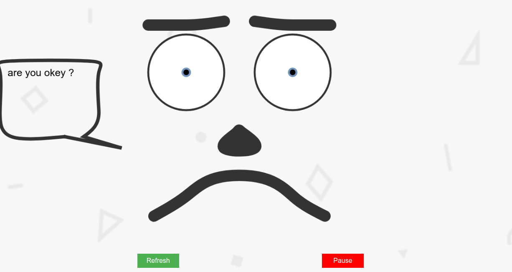
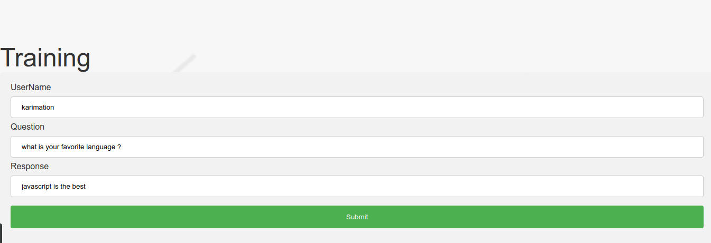

# Snopi
Voice assisted bot with Web Speech API and DialogFlow

<div>


</div>


# Description
Snopi is bot that replies to a user’s query through voice and text. 
You can ask questions to these bots orally with a voice command and they have the ability to answer back in a specific voice.

To make sure that Snopi matches user input as often as possible, 
i added a training interface.

# Demo 

[](https://snopi.herokuapp.com)


# Installation
git clone https://gitlab.com/steemitgram/steemitgram-mobile.git

```
npm install
nodemon
```

or

```
yarn install
yarn start
```


# License:

<a href="LICENSE">MIT License</a> Copyright (c) 2018 karimation
